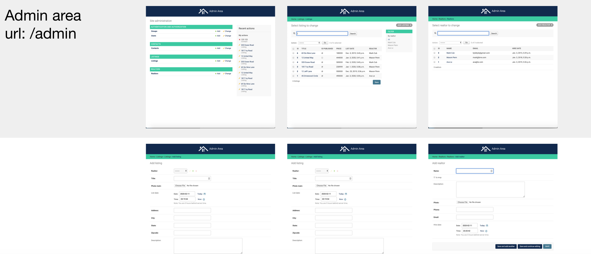

# BT Real Estate site, a mobile-friendly Django app
* layout: Bootstrap4 
* database: PostgreSQL & pdAdmin

Pages:

- #### Homepage: url /

- #### Form: 
  + Search for available listing: search filters are: keyword, location, price, home feature.

- #### About: url /about
  + realtors info. Can add more realtors in Admin area

- #### Listings: url /listings
  + thumbnails display, Pagination, contain individual listing pages. 

- #### Individual listing: url /listings/int# 
  + has an assigned realtor (foreign key), home photos display in light box (Lightbox 2), 

- #### Form: 
  + Inquiry pre-populated form (based on users’ info): can send actual emails via django.core.mail

- ### User: urls /accounts/register, and /accounts/login, and accounts/dashboard
  + dashboard shows all housing inquiries a user has made

- ### Admin area: url /admin
  + Implement many staff-only operations: can login, manage listings (add, publish, assign realtors, …), realtors (seller of the month, assign listings), and client inquiries.

After cloning this repo and install dependencies (specified in requirements.txt):
Django==3.0.2
Pillow==7.0.0
psycopg2==2.8.4
psycopg2-binary==2.8.4
pytz==2019.3

You also need PostgreSQL. Start PostgreSQL server, then run this on your local machine's terminal:
`$ python3 manage.py runserver`

## DEMO:

